<div dir="rtl" align="right">

# 📘 راكب — الكتاب المرجعي الرسمي

**منصة إدارة النقل الذكية لطلاب الكورسات والمعسكرات التدريبية**

---

> **الإصدار:** 1.0  
> **آخر تحديث:** أغسطس 2026  
> **الحالة:** Phase 1 ✅ مكتمل · Phase 2 (Multi-Vehicle) ✅ مكتمل · Phase 3 🔜 قيد التخطيط  
> **الفريق:** فريق تطوير راكب  

---

## 📑 فهرس المحتويات

| # | القسم |
|---|-------|
| 1 | [المقدمة](#1-المقدمة) |
| 2 | [سير العمل الحالي (قبل راكب)](#2-سير-العمل-الحالي-قبل-راكب) |
| 3 | [الرؤية](#3-الرؤية) |
| 4 | [الأهداف](#4-الأهداف) |
| 5 | [المستخدمون](#5-المستخدمون) |
| 6 | [رحلة الطالب الكاملة](#6-رحلة-الطالب-الكاملة) |
| 7 | [رحلة المنسق الكاملة](#7-رحلة-المنسق-الكاملة) |
| 8 | [مميزات النظام](#8-مميزات-النظام) |
| 9 | [سير عمل النقل](#9-سير-عمل-النقل) |
| 10 | [منطق المركبات المتعددة](#10-منطق-المركبات-المتعددة) |
| 11 | [القواعد التشغيلية](#11-القواعد-التشغيلية) |
| 12 | [مبادئ تجربة المستخدم](#12-مبادئ-تجربة-المستخدم) |
| 13 | [نظرة عامة على قاعدة البيانات](#13-نظرة-عامة-على-قاعدة-البيانات) |
| 14 | [هيكل النظام](#14-هيكل-النظام) |
| 15 | [خطة التشغيل التجريبي](#15-خطة-التشغيل-التجريبي) |
| 16 | [مؤشرات الأداء الرئيسية](#16-مؤشرات-الأداء-الرئيسية) |
| 17 | [معايير النجاح](#17-معايير-النجاح) |
| 18 | [خارطة الطريق المستقبلية](#18-خارطة-الطريق-المستقبلية) |
| 19 | [المخاطر والتخفيف](#19-المخاطر-والتخفيف) |
| 20 | [الدروس المستفادة](#20-الدروس-المستفادة) |
| 21 | [المسرد](#21-المسرد) |
| 22 | [الخاتمة](#22-الخاتمة) |

---

# 1. المقدمة

## ١.١ ما هو راكب؟

**راكب** هو منصة ويب ذكية لإدارة نقل طلاب الكورسات والمعسكرات التدريبية. المنصة بتحوّل عملية النقل اليدوية المعقدة — اللي بتعتمد على Google Forms وWhatsApp والتنسيق التليفوني — لنظام رقمي متكامل بيغطي العملية من أول تسجيل الطالب لحضوره لحد وصوله لمكان التدريب.

## ١.٢ ليه اتعمل راكب؟

كل يوم تدريب، المنسقين بيقضوا وقت كبير في:
- تجميع بيانات الطلاب يدوياً من Google Forms
- فرز الأسماء على جداول Excel
- التواصل مع كل طالب على WhatsApp
- متابعة الحضور والغياب بالتليفون
- تنسيق حركة الباصات في الوقت الفعلي

ده بيخلي العملية **بطيئة، عرضة للأخطاء، ومُرهقة** للمنسقين والطلاب.

## ١.٣ المشكلة اللي بيحلها

| المشكلة | التأثير |
|---------|---------|
| التسجيل اليدوي عبر Google Forms | بطء في جمع البيانات وصعوبة التحقق |
| الفرز اليدوي في Google Sheets | أخطاء في الأسماء ونقاط التجمع |
| التواصل عبر WhatsApp | رسائل ضايعة وعدم تأكيد الاستلام |
| متابعة الحضور بالتليفون | ضغط على المنسقين وتأخير في البدء |
| عدم وجود تتبع حي | الطلاب مش عارفين الباص فين |
| لا يوجد سجل تاريخي | صعوبة في التخطيط المستقبلي |

## ١.٤ ليه سير العمل الحالي مش كفء؟

سير العمل الحالي (بدون راكب) فيه مشاكل جوهرية:

1. **لا مركزية** — البيانات موزعة بين Forms وSheets وWhatsApp
2. **لا أتمتة** — كل خطوة بتحتاج تدخل بشري
3. **لا وقت حقيقي** — المعلومات بتوصل متأخرة
4. **لا تاريخ** — مفيش سجل للرحلات السابقة
5. **لا قابلية للتوسع** — كل ما عدد الطلاب زاد، المشاكل بتتضاعف

---

# 2. سير العمل الحالي (قبل راكب)

## ٢.١ الخطوات التفصيلية

العملية الحالية بدون راكب بتمر بالمراحل دي:

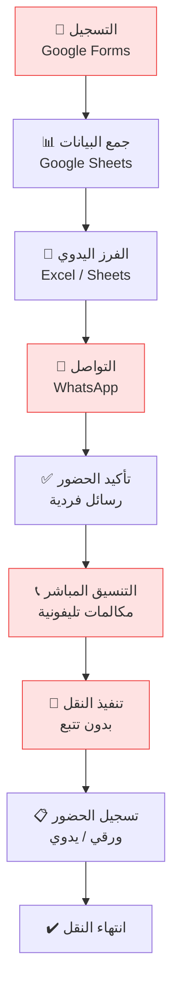

## ٢.٢ نقاط الألم التفصيلية

### 📝 مرحلة التسجيل
- الطالب بيملأ Google Form كل مرة
- مفيش حساب ثابت — كل مرة بيانات جديدة
- احتمال أخطاء في الأسماء أو الأرقام
- مفيش تحقق من صحة البيانات (الرقم القومي، رقم الموبايل)

### 📊 مرحلة الفرز
- المنسق بيفتح Google Sheets وبيفرز يدوي
- بيقسّم الطلاب حسب نقاط التجمع
- ممكن يحصل خطأ في الفرز أو يتنسى طالب

### 💬 مرحلة التواصل
- المنسق بيبعت رسايل WhatsApp لكل طالب
- الطالب ممكن ميشوفش الرسالة
- لو الطالب غيّر رأيه (مش هيحضر)، لازم يبلّغ المنسق يدوي
- الرسائل بتضيع وسط المحادثات

### 📞 مرحلة التنسيق
- المنسق بيتصل بالطلاب المتأخرين
- مكالمات كتير في وقت قصير
- ضغط نفسي وجسدي على المنسق

### 🚌 مرحلة التنفيذ
- الطلاب مش عارفين الباص فين
- لو الباص اتأخر، مفيش طريقة تبليغ الطلاب
- لو طالب في مكان غلط، صعب يتواصل مع المنسق

### 📋 مرحلة الحضور
- تسجيل الحضور ورقي أو عبر رسائل
- مفيش سجل رقمي
- صعب تعرف مين ركب ومين لأ بالظبط

---

# 3. الرؤية

## ٣.١ راكب مش مجرد متتبع باصات

**راكب هو منصة إدارة نقل متكاملة.** الرؤية الكاملة هي إن راكب يكون النظام المركزي اللي بيدير كل حاجة متعلقة بنقل الطلاب:

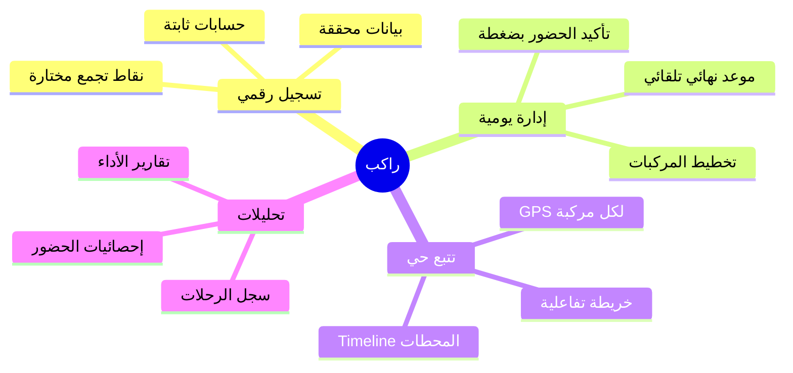

## ٣.٢ الرؤية طويلة المدى

| المرحلة | الوصف |
|---------|-------|
| **Phase 1** ✅ | نظام أساسي — تسجيل، حضور، تتبع، رحلة واحدة |
| **Phase 2** ✅ | مركبات متعددة — تخطيط، تعيين منسقين، ركوب مشترك |
| **Phase 3** 🔜 | كورسات متعددة — فصل كامل بين الكورسات |
| **Phase 4** 📋 | تطبيق سائق — تطبيق مخصص للسائقين |
| **Phase 5** 📋 | تحليلات وتقارير متقدمة — AI recommendations |

---

# 4. الأهداف

## ٤.١ أهداف الأعمال (Business)

| الهدف | الوصف | المقياس |
|-------|-------|---------|
| تقليل التكلفة التشغيلية | تقليل الوقت والجهد المطلوب من المنسقين | ↓ 70% وقت التخطيط |
| تحسين الكفاءة | أتمتة العمليات اليدوية بالكامل | ↓ 90% رسائل WhatsApp |
| إمكانية التوسع | دعم عدد أكبر من الطلاب والكورسات | ∞ قابلية التوسع |
| بيانات دقيقة | سجلات رقمية موثقة وقابلة للمراجعة | 100% توثيق رقمي |

## ٤.٢ أهداف تشغيلية (Operational)

- **صفر اعتماد على WhatsApp** للتنسيق
- **صفر مكالمات تليفونية** لتأكيد الحضور
- **تخطيط مركبات** في أقل من 5 دقائق
- **تسجيل حضور** فوري بدون ورق
- **تتبع GPS حي** لكل مركبة

## ٤.٣ أهداف تجربة الطالب (Student Experience)

- الطالب **يسجّل مرة واحدة** ويفضل يستخدم حسابه
- الطالب **يأكد حضوره بضغطة واحدة** (Toggle)
- الطالب **يعرف الباص فين** في أي لحظة على الخريطة
- الطالب **مش محتاج يقرر حاجة** — النظام بيوجهه
- الطالب **يفهم كل حاجة** بدون ما يحتاج يسأل حد

## ٤.٤ أهداف المنسق (Coordinator)

- المنسق **يشوف ملخص كامل** للطلاب ونقاط التجمع
- المنسق **يخطط المركبات** قبل بدء اليوم
- المنسق **يتحكم في مركبته** بشكل مستقل
- المنسق **يسجّل ركوب الطلاب** بضغطة
- المنسق **ينهي الرحلة** عند الوصول

## ٤.٥ أهداف الإدارة (Management)

- **رؤية شاملة** لكل الرحلات والمركبات
- **سجل تاريخي** لكل الرحلات السابقة
- **إحصائيات** دقيقة عن الحضور والاستخدام
- **تقارير** قابلة للتصدير (Excel / PDF)
- **تحكم كامل** في الإعدادات والمواعيد

---

# 5. المستخدمون

## ٥.١ الطالب (Student)

```
الدور: student
الصلاحيات: قراءة محدودة + كتابة حالته فقط
```

| المسؤولية | التفاصيل |
|-----------|----------|
| التسجيل | إنشاء حساب مرة واحدة ببياناته الشخصية |
| اختيار نقطة التجمع | اختيار النقطة الافتراضية عند التسجيل |
| تأكيد الحضور اليومي | تفعيل/إلغاء مفتاح "هحضر النهارده" |
| تغيير نقطة التجمع | تغيير مؤقت أو دائم لنقطة التجمع |
| تتبع المركبة | مشاهدة موقع المركبات على الخريطة |
| معرفة حالة الركوب | مشاهدة هل تم تسجيل ركوبه أم لا |

**ملاحظة مهمة:** الطالب **لا يختار المركبة** ولا يتحكم في أي قرار متعلق بالنقل. النظام مصمم بحيث الطالب يأكد حضوره بس وكل حاجة تانية بتحصل تلقائي.

## ٥.٢ المنسق / المسؤول (Coordinator / Admin)

```
الدور: admin
الصلاحيات: قراءة وكتابة كاملة
```

| المسؤولية | التفاصيل |
|-----------|----------|
| مراجعة الحضور | شوف مين أكد ومين لغى |
| تخطيط المركبات | إضافة أتوبيسات وميكروباصات وتحديد السعات |
| بدء اليوم | تفعيل النظام وبدء التنقل |
| التحكم في المركبة | أخذ مسؤولية مركبة معينة |
| تتبع GPS | مشاركة موقعه مع الطلاب |
| تسجيل الركوب | تأكيد ركوب كل طالب |
| إدارة المحطات | التحرك بين نقاط التجمع |
| إنهاء الرحلة | إنهاء مسار المركبة عند الوصول |
| إنهاء اليوم | إغلاق اليوم والانتقال لليوم التالي |
| إدارة الإعدادات | التحكم في المواعيد والسعات |
| إدارة نقاط التجمع | إضافة/تعديل/ترتيب نقاط التجمع |
| إدارة الطلاب | عرض بيانات الطلاب وأدوارهم |
| عرض السجل والإحصائيات | مراجعة تاريخ الرحلات والأداء |

## ٥.٣ مخطط الصلاحيات

| الإجراء | الطالب | المنسق |
|---------|--------|--------|
| تسجيل حساب | ✅ (role: student فقط) | ❌ (يُنشأ يدوياً) |
| قراءة نقاط التجمع | ✅ | ✅ |
| تعديل حالة الحضور اليومية | ✅ (حالته فقط + قبل الموعد النهائي) | ✅ (أي طالب) |
| قراءة المركبات | ✅ | ✅ |
| إنشاء/حذف مركبة | ❌ | ✅ |
| تعديل GPS المركبة | ❌ | ✅ (المركبة المُعيّن لها فقط) |
| تسجيل الركوب | ❌ | ✅ |
| قراءة سجلات الركوب | ✅ (سجله فقط) | ✅ (الكل) |
| إدارة الإعدادات | ❌ | ✅ |
| عرض كل المستخدمين | ❌ | ✅ |

---

# 6. رحلة الطالب الكاملة

## ٦.١ مخطط الرحلة

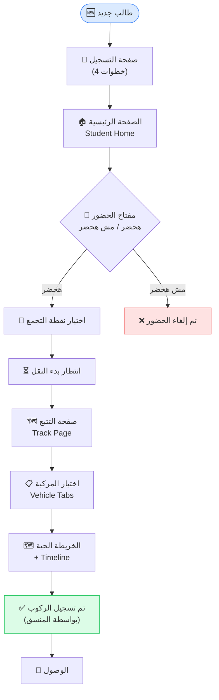

## ٦.٢ تفاصيل كل شاشة

### الخطوة ١: صفحة التسجيل (`/register`)

التسجيل مقسم لـ **4 خطوات** مع انيميشن سلس بين كل خطوة:

| الخطوة | المحتوى | الحقول |
|--------|---------|--------|
| **1 — الترحيب** | "أهلاً بيك 👋" + شرح مختصر | — |
| **2 — المعلومات الشخصية** (1 من 3) | بيانات الطالب | الاسم بالكامل · رقم الموبايل · الرقم القومي (14 رقم) |
| **3 — نقطة التجمع** (2 من 3) | اختيار نقطة التجمع الافتراضية | Select من نقاط التجمع المتاحة |
| **4 — إعداد الحساب** (3 من 3) | بيانات تسجيل الدخول | البريد الإلكتروني · كلمة المرور (≥6 أحرف) |
| **5 — النجاح** | "حسابك جاهز! ✅" | زر "ابدأ" → الصفحة الرئيسية |

**التحققات:**
- الرقم القومي لازم يكون 14 رقم بالظبط
- رقم الموبايل بين 10 و 15 رقم
- كلمة المرور 6 أحرف على الأقل
- نقطة التجمع إجبارية

### الخطوة ٢: الصفحة الرئيسية (`/student/home`)

| العنصر | الوصف |
|--------|-------|
| **التحية** | "أهلاً [الاسم الأول] 👋" + "إدارة رحلتك اليوم" |
| **مفتاح الحضور (RideSwitch)** | Toggle كبير — "هحضر النهارده 🟢" أو "مش هحضر ❌" |
| **العد التنازلي (CountdownTimer)** | الوقت المتبقي لغلق التسجيل |
| **اختيار نقطة التجمع (StationPicker)** | يظهر فقط لما الطالب مفعّل الحضور |
| **تحذير الموعد** | رسالة تحذيرية لو التسجيل اتقفل |
| **حالة الرحلة (TripStatusBanner)** | بانر بيوضح حالة النقل الحالية |

**السلوكيات:**
- لو الطالب غيّر نقطة التجمع ← بيظهر **Drawer** بيسأله: "لليوم بس" ولا "تعيين كنقطة افتراضية"
- لو التسجيل اتقفل (بعد الموعد النهائي أو قفل يدوي) ← المفتاح بيتقفل مع رسالة توضيحية
- لو نقطة التجمع القديمة اتحذفت ← رسالة تحذير وبيطلب من الطالب يختار نقطة جديدة

### الخطوة ٣: صفحة التتبع (`/student/track`)

| العنصر | الوصف |
|--------|-------|
| **شريط المركبات (VehicleTabStrip)** | Pills بتوضح كل المركبات النشطة مع إيموجي ولون |
| **حالة المركبة (StudentVehicleStatus)** | بانر مصغر بحالة المركبة المختارة |
| **الخريطة الحية (TrackMap)** | خريطة Leaflet بتوضح موقع المركبة المختارة |
| **الـ Timeline (StationTimeline)** | مسار المحطات — فين المركبة دلوقتي |
| **بطاقة "فاتتك" (VehiclePassedCard)** | لو المركبة عدّت نقطة الطالب |

**حالات المركبة على الخريطة:**
- 🟢 **مركبتي** (mine) — المركبة اللي الطالب ركبها
- 🔵 **متاحة** (available) — مركبة تانية شغالة
- 🔴 **ممتلئة** (full) — مركبة سعتها كملت

### الحالات والإشعارات

| الحالة | ما يراه الطالب |
|--------|---------------|
| `pending` (لم يبدأ) | "لسه مفيش مركبات شغالة النهارده" |
| `running` (الباص يتحرك) | الخريطة الحية + Timeline |
| `waiting_at_station` (واقف في محطة) | المحطة الحالية محددة في الـ Timeline |
| `full` (المركبة ممتلئة) | إخفاء المركبة من الاختيارات النشطة |
| `ended` (انتهت الرحلة) | "اكتملت الرحلة بنجاح" |

---

# 7. رحلة المنسق الكاملة

## ٧.١ مخطط سير العمل

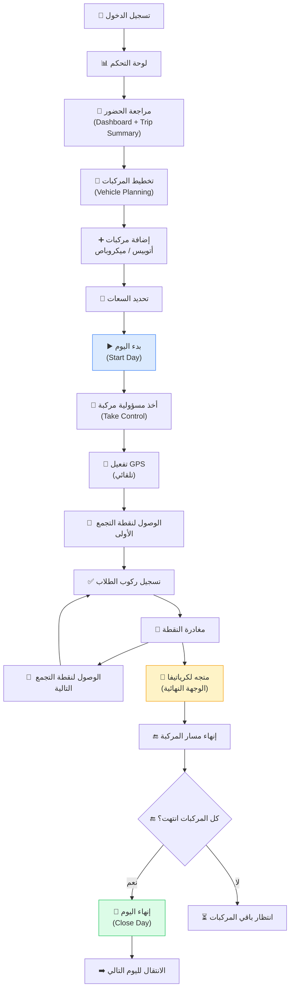

## ٧.٢ تفاصيل كل مرحلة

### مرحلة التخطيط (Vehicle Planning)

> **الشاشة:** `trips.lazy.tsx` — حالة `pending`  
> **المكون:** `VehiclePlanning.tsx`

| العنصر | الوصف |
|--------|-------|
| عدد الطلاب المؤكدين | إجمالي الطلاب اللي فعّلوا الحضور |
| السعة الإجمالية | مجموع سعات المركبات المضافة |
| حالة الكفاية | "سعة كافية ✅" أو "نقص في السعة ⚠️" |
| أزرار الإضافة | 🚌 أتوبيس (50 مقعد افتراضي) / 🚐 ميكروباص (14 مقعد افتراضي) |
| بطاقات المركبات | لكل مركبة: اسم + سعة قابلة للتعديل + زر حذف |
| زر "بدء اليوم" | متاح فقط لما يكون فيه مركبة واحدة على الأقل |

### مرحلة التحكم (Active Vehicles)

> **المكون:** `ActiveVehicles.tsx`

| العنصر | الوصف |
|--------|-------|
| قائمة المركبات | كل مركبة ببطاقة مستقلة |
| حالة التعيين | "أنت المسؤول" أو "المسؤول: [اسم]" أو "غير مُعيّنة" |
| Take Control | أخذ مسؤولية مركبة (Transaction atomic) |
| Release Control | التخلي عن المسؤولية |
| حالة GPS | مؤشر تتبع الموقع |

### مرحلة التنقل (Vehicle Controls + Boarding)

> **المكونات:** `VehicleControls.tsx` + `BoardingList.tsx` + `StationTimeline.tsx`

**التحكم في المركبة:**
- بدء الرحلة (Start Trip) — إدخال رقم لوحة المركبة
- مغادرة النقطة (Depart Station)
- الوصول للنقطة التالية (Arrive at Station)
- إنهاء مسار المركبة (End Vehicle Trip)

**تسجيل الركوب:**
- قائمة طلاب مرتبة حسب نقطة التجمع
- ✅ ضغطة واحدة لتأكيد الركوب
- ↩️ إمكانية التراجع (Undo Boarding)
- المحطة النشطة بتكون بارزة ومثبتة (Sticky)

### مرحلة الإنهاء

**إنهاء المركبة:**
- عند الوصول لكرياتيفا (الوجهة النهائية)
- حالة المركبة بتتغير لـ `ended`

**إنهاء اليوم (Close Day):**
- متاح فقط لما كل المركبات تكون `ended`
- بيعمل أرشفة لبيانات اليوم في `tripHistory`
- بينقل `activeDateKey` لليوم التالي
- بيحسب `cutoffTimestamp` الجديد

---

# 8. مميزات النظام

## ٨.١ التسجيل والمصادقة (Registration & Authentication)

| الميزة | التفاصيل |
|--------|----------|
| **تسجيل متعدد الخطوات** | 4 خطوات مع Animations (Framer Motion) |
| **Firebase Authentication** | Email + Password |
| **حساب ثابت** | الطالب بيسجل مرة واحدة |
| **Role-based** | `student` أو `admin` — يُحدد عند الإنشاء |
| **Auto-retry** | لو الاتصال فشل، بيحاول 5 مرات |
| **Safety Timeout** | لو المصادقة ما ردّتش في 10 ثواني ← رسالة خطأ |

## ٨.٢ نقاط التجمع (Pickup Points / Stations)

| الميزة | التفاصيل |
|--------|----------|
| **مُدارة مركزياً** | المسؤول بيضيفها ويعدلها |
| **مرتبة بالتسلسل** | بتحدد مسار المركبة |
| **بيانات غنية** | اسم + تفاصيل + وقت + إحداثيات GPS |
| **Leaflet Map** | بتظهر على الخريطة للمنسق والطالب |
| **Default Seeding** | لو قاعدة البيانات فاضية، بيتم زراعة نقاط افتراضية (أسوان) |

## ٨.٣ الحضور اليومي (Daily Attendance)

| الميزة | التفاصيل |
|--------|----------|
| **Toggle بسيط** | مفتاح "هحضر النهارده" |
| **Cutoff Time** | موعد نهائي لغلق التسجيل (قابل للتخصيص) |
| **Force Lock** | قفل يدوي فوري من المسؤول |
| **Server Time Validation** | التحقق من وقت الخادم لمنع التلاعب بساعة الجهاز |
| **Custom Location** | الطالب يقدر يحدد موقعه الجغرافي كنقطة مخصصة |

## ٨.٤ يوم النقل (Transportation Day)

| الميزة | التفاصيل |
|--------|----------|
| **Active Date Key** | تاريخ الرحلة النشطة (YYYY-MM-DD) |
| **حالات اليوم** | `pending` → `waiting_at_station` / `running` → `completed` |
| **الانتقال التلقائي** | عند إنهاء اليوم بيتم الانتقال لليوم التالي |
| **Cutoff Timestamp Sync** | الموعد النهائي بيتحدث تلقائياً لليوم الجديد |

## ٨.٥ تخطيط المركبات (Vehicle Planning)

| الميزة | التفاصيل |
|--------|----------|
| **أنواع المركبات** | 🚌 أتوبيس (50 مقعد) · 🚐 ميكروباص (14 مقعد) |
| **إضافة/حذف ديناميكي** | إضافة أي عدد من المركبات لكل يوم |
| **تعديل السعة** | Stepper (+/-) لتعديل سعة كل مركبة |
| **داشبورد مرئي** | طلاب مؤكدين vs سعة إجمالية مع شريط حالة |
| **Guard: حذف المخططة فقط** | المركبات الشغالة لا يمكن حذفها |

## ٨.٦ المركبات المتعددة (Multi Vehicle)

| الميزة | التفاصيل |
|--------|----------|
| **مركبات مستقلة** | كل مركبة ليها حالة ومنسق ومسار مستقل |
| **نفس المسار** | كل المركبات بتمر على نفس نقاط التجمع |
| **Take Control** | Transaction atomique لمنع التعيين المزدوج |
| **Release Control** | تحرير المركبة يدوياً أو تلقائياً (Stale Timeout: 60 ثانية) |
| **Heartbeat** | المنسق بيبعت إشارة كل 10 ثواني |

## ٨.٧ التتبع الحي (Live Tracking)

| الميزة | التفاصيل |
|--------|----------|
| **GPS مستقل لكل مركبة** | كل منسق بيشارك موقعه لمركبته |
| **Leaflet Maps** | خرائط تفاعلية مع Markers ملونة |
| **Throttling** | تحديث الموقع كل 10 ثواني |
| **High Accuracy** | `enableHighAccuracy: true` |
| **Fallback** | رسالة خطأ لو GPS مش مفعّل |

## ٨.٨ الـ Timeline (Station Timeline)

| الميزة | التفاصيل |
|--------|----------|
| **مسار مرئي** | كل نقطة تجمع ممثلة كنقطة في الـ Timeline |
| **حالات النقاط** | تم زيارتها ✅ · حالية 🔵 · قادمة ⚪ |
| **الوجهة النهائية** | كرياتيفا (Creativa) كنقطة نهاية ثابتة |

## ٨.٩ الإشعارات (Notifications)

| الميزة | التفاصيل |
|--------|----------|
| **Toast Messages** | إشعارات فورية عبر Sonner |
| **حالات الرحلة** | إشعار عند بدء/إنهاء الرحلة |
| **حالة الركوب** | إشعار تأكيد/إلغاء الركوب |
| **Client-Triggered** | الإشعارات حالياً client-side (FCM مؤجل) |

## ٨.١٠ لوحة التحكم (Dashboard)

| الميزة | التفاصيل |
|--------|----------|
| **ملخص الطلاب** | إجمالي المسجلين والمؤكدين والملغين |
| **ملخص المركبات** | عدد المركبات والسعة الإجمالية والمشغولة |
| **بطاقات إحصائية** | StatsCards بأرقام سريعة |

## ٨.١١ الإعدادات (Settings)

| الإعداد | الوصف |
|---------|-------|
| **وقت غلق التسجيل** | الساعة اللي بيتقفل فيها التسجيل (24h format) |
| **تفعيل/إلغاء الغلق التلقائي** | Switch لتفعيل الموعد النهائي |
| **القفل اليدوي** | Force Lock — قفل فوري بغض النظر عن الوقت |
| **تاريخ الرحلة القادمة** | Active Date Key |
| **سعات المركبات** | الأرقام الافتراضية لكل نوع مركبة |

## ٨.١٢ السجل والتاريخ (History)

| الميزة | التفاصيل |
|--------|----------|
| **أرشيف الرحلات** | كل رحلة مكتملة بتتحفظ في `tripHistory` |
| **بيانات مفصلة** | وقت البدء والانتهاء، عدد الطلاب، المدة |
| **Audit Log** | سجل تدقيق لكل إجراء (بدء، إنهاء، ركوب) |

## ٨.١٣ التقارير والتصدير (Reports & Export)

| الميزة | التفاصيل |
|--------|----------|
| **تصدير Excel** | بيانات الطلاب والرحلات بصيغة XLSX |
| **تصدير PDF** | ملخصات الرحلات بصيغة PDF (jsPDF) |
| **إحصائيات** | رسوم بيانية عبر Recharts |

---

# 9. سير عمل النقل

## ٩.١ المخطط التفصيلي

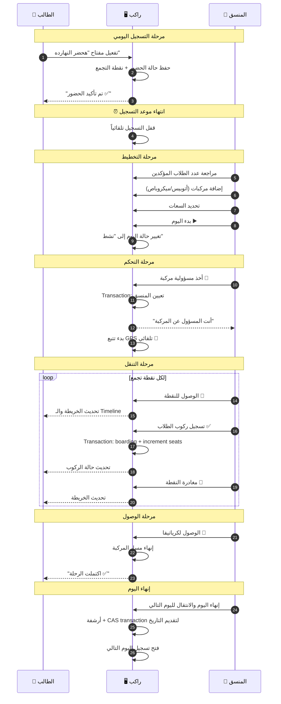

## ٩.٢ الخطوات التفصيلية

| # | الخطوة | المسؤول | التفاصيل |
|---|--------|---------|----------|
| 1 | فتح التسجيل | النظام | تلقائي بعد إنهاء اليوم السابق |
| 2 | تأكيد الحضور | الطالب | Toggle + اختيار نقطة التجمع |
| 3 | غلق التسجيل | النظام | تلقائي عند الموعد النهائي أو يدوي |
| 4 | مراجعة الأعداد | المنسق | Dashboard — عدد المؤكدين والملغين |
| 5 | إضافة المركبات | المنسق | تحديد النوع والسعة لكل مركبة |
| 6 | بدء اليوم | المنسق | تفعيل النظام → حالة "نشط" |
| 7 | أخذ المسؤولية | المنسق | Take Control على مركبة محددة |
| 8 | التحرك | المنسق | GPS يعمل تلقائي + مشاركة الموقع |
| 9 | الوصول لنقطة | المنسق | ضغطة "الوصول للنقطة التالية" |
| 10 | تسجيل الركوب | المنسق | ✅ لكل طالب ركب |
| 11 | مغادرة النقطة | المنسق | ضغطة "مغادرة النقطة" |
| 12 | تكرار 9-11 | المنسق | لكل نقطة تجمع |
| 13 | الوصول للوجهة | المنسق | "الوصول إلى كرياتيفا وإنهاء الرحلة" |
| 14 | إنهاء اليوم | المنسق | بعد ما كل المركبات تنتهي |

---

# 10. منطق المركبات المتعددة

## ١٠.١ القواعد الأساسية

- 🚫 **الطالب لا يختار المركبة أبداً**
- 📍 **كل المركبات بتمر على نفس المسار**
- 👤 **كل مركبة ليها منسق واحد بس**
- 🔢 **السعة بتتتبع بالـ Transaction**
- 📋 **قائمة الركوب مشتركة بين كل المركبات**
- 🔄 **الركوب قابل للتراجع (Undo)**

## ١٠.٢ حالات المركبة (Vehicle States)

| الحالة | الوصف | الانتقالات المسموحة |
|--------|-------|---------------------|
| `planned` | مضافة في مرحلة التخطيط | → `running` (عند بدء الرحلة) |
| `running` | شغالة وبتتحرك | → `full` (عند امتلاء السعة) · → `ended` (عند الوصول) |
| `full` | ممتلئة (تلقائي أو يدوي) | → `ended` (عند الوصول) |
| `ended` | انتهت رحلتها | — (حالة نهائية) |

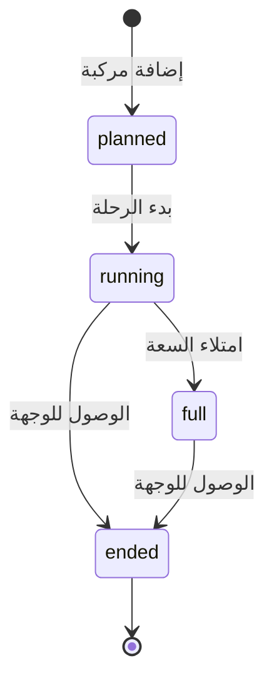

## ١٠.٣ آلية التعيين (Assignment Logic)

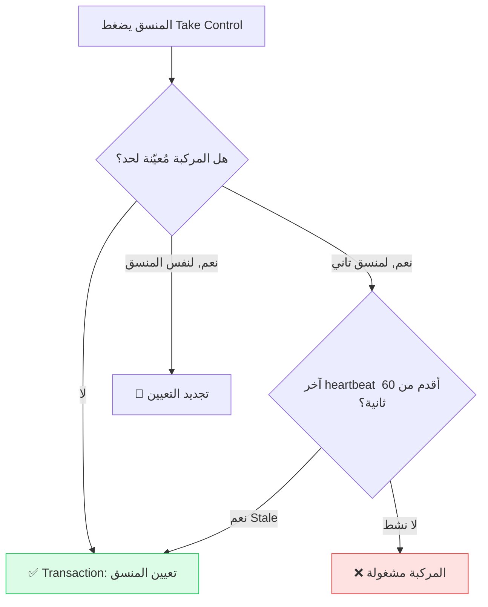

## ١٠.٤ آلية الركوب (Boarding Logic)

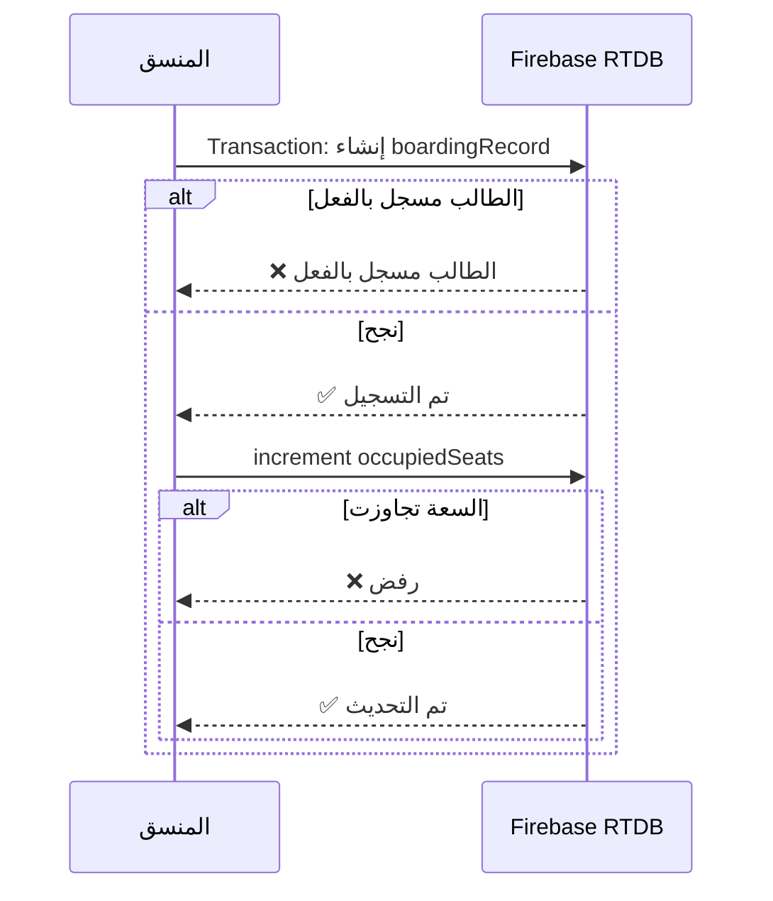

## ١٠.٥ سعة المركبة

| القاعدة | التفاصيل |
|---------|----------|
| السعة الافتراضية — أتوبيس | 50 مقعد |
| السعة الافتراضية — ميكروباص | 14 مقعد |
| `occupiedSeats` | بيزيد مع كل boarding وبينقص مع كل undo |
| التحقق من السعة | Security Rules: `occupiedSeats ≤ capacity` |
| Full Status | تلقائي عند `occupiedSeats = capacity` أو يدوي من المنسق |

---

# 11. القواعد التشغيلية

## ١١.١ جدول القواعد الكامل

| # | القاعدة | التفاصيل | النوع |
|---|---------|----------|-------|
| R01 | الطالب يأكد حضوره فقط | لا يختار مركبة ولا يتحكم في النقل | أساسية |
| R02 | الطالب لا يختار المركبة | المنسق هو اللي بيعيّن المركبات | أساسية |
| R03 | كل المركبات على نفس المسار | نفس نقاط التجمع بالترتيب | أساسية |
| R04 | التسجيل يقفل قبل التخطيط | الموعد النهائي لازم يكون قبل بدء اليوم | تشغيلية |
| R05 | منسق واحد لكل مركبة | Atomic Transaction لمنع التعيين المزدوج | تقنية |
| R06 | السعة لا تتجاوز الحد | Security Rules بتمنع `occupiedSeats > capacity` | تقنية |
| R07 | الركوب قابل للتراجع | soft-delete بحالة `undone` | تشغيلية |
| R08 | GPS المنسق المُعيّن فقط | Security Rules: `assignedCoordinatorId === auth.uid` | تقنية |
| R09 | إنهاء اليوم يدوي | لا ينتهي تلقائياً — يحتاج ضغطة من المنسق | تشغيلية |
| R10 | كل المركبات لازم تنتهي قبل إنهاء اليوم | زر "إنهاء اليوم" مش متاح لو فيه مركبة شغالة | تشغيلية |
| R11 | الانتقال للتاريخ التالي بـ CAS | Compare-and-Swap Transaction لمنع Race Conditions | تقنية |
| R12 | Stale Assignment Recovery | بعد 60 ثانية بدون heartbeat، منسق تاني يقدر يأخذ المركبة | تقنية |
| R13 | الطالب يقدر يغير نقطة التجمع مؤقتاً أو دائماً | Drawer بيسأله عن نوع التغيير | UX |
| R14 | الطالب يشوف كل المركبات النشطة | بس ميقدرش يختار واحدة — بيشوفهم بس | أساسية |
| R15 | Server Time Validation | التحقق من وقت الخادم لمنع التلاعب | تقنية |
| R16 | المركبة المخططة فقط يمكن حذفها | بعد بدء الرحلة لا يمكن حذف المركبة | تشغيلية |
| R17 | المركبة المخططة فقط يمكن تعديل سعتها | بعد بدء الرحلة السعة ثابتة | تشغيلية |
| R18 | الطالب يسجل حساب بدور student فقط | لا يمكنه تغيير دوره | أمنية |
| R19 | تحذير لو الموعد النهائي لليوم التالي انتهى | لو المنسق بينهي اليوم والموعد عدّا | تشغيلية |

## ١١.٢ شجرة القرارات — هل التسجيل مفتوح؟

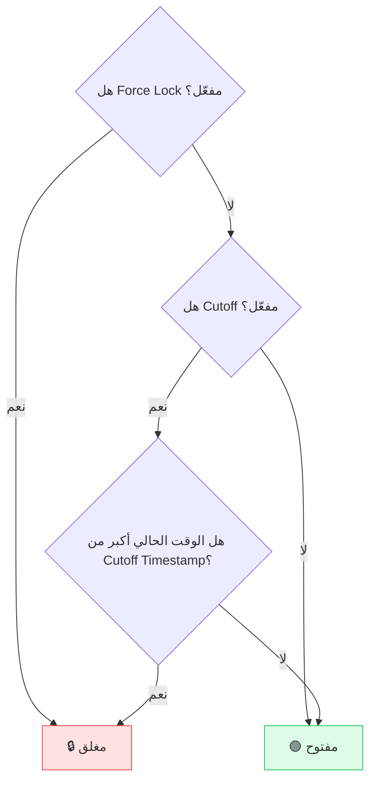

## ١١.٣ شجرة القرارات — هل يمكن تسجيل ركوب طالب؟

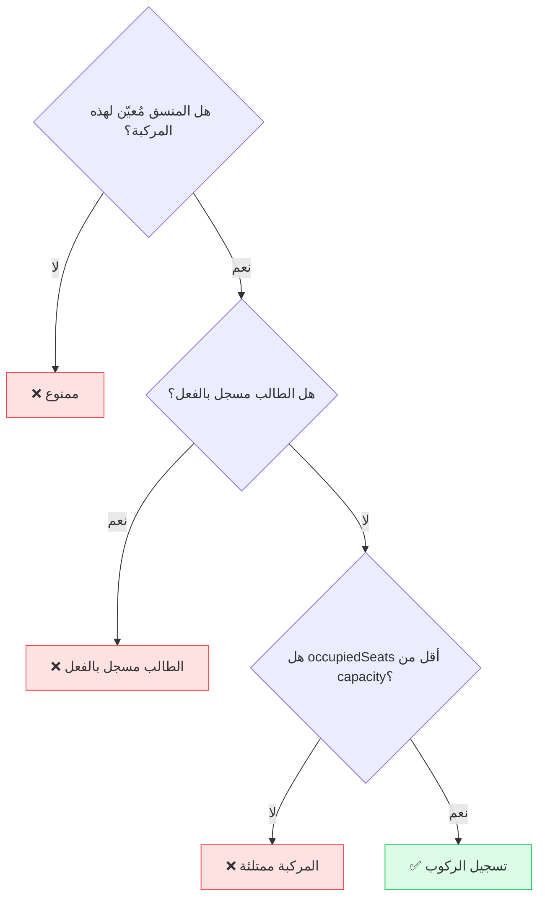

---

# 12. مبادئ تجربة المستخدم

## ١٢.١ الفلسفة الأساسية

> **الطالب لازم يفهم كل حاجة من غير ما يسأل حد.**

التصميم مبني على المبادئ دي:

### 🎯 مبدأ ١: الطالب مايتلخبطش أبداً
- كل شاشة ليها هدف واحد واضح
- مفيش خيارات معقدة أو قرارات صعبة
- الطالب بيأكد حضوره بس — الباقي بيحصل تلقائي

### 🚫 مبدأ ٢: الطالب مش بياخد قرارات نقل
- الطالب **مايختارش مركبة**
- الطالب **مايختارش مسار**
- الطالب **مايختارش وقت**
- كل ده من مسؤولية المنسق والنظام

### 🧭 مبدأ ٣: كل حاجة موجّهة (Guided)
- التسجيل خطوة بخطوة مع Animations
- الحالات واضحة بألوان مميزة (أخضر/أصفر/أحمر)
- رسائل التأكيد والخطأ واضحة ومختصرة

### 🇪🇬 مبدأ ٤: العربية المصرية
- النصوص بالعربية المصرية العامية حيث مناسب
- أمثلة: "أهلاً بيك 👋"، "يلا نبدأ"، "هحضر النهارده"، "مش هحضر"
- النصوص الرسمية بالعربية الفصحى المبسطة

### 📱 مبدأ ٥: Mobile-First
- التصميم مُحسّن للموبايل أولاً
- Touch targets ≥ 44px (Apple HIG)
- No horizontal scroll
- Responsive Grid (1 col mobile, 2-3 cols desktop)

### ⚡ مبدأ ٦: أقل عدد من الضغطات
- تأكيد الحضور = ضغطة واحدة (Toggle)
- تسجيل الركوب = ضغطة واحدة (Checkbox)
- مغادرة النقطة = ضغطة واحدة (Button)

### 💬 مبدأ ٧: ردود فعل واضحة
- كل إجراء ليه Toast Message فوري
- حالات التحميل واضحة (Skeleton Loaders)
- حالات الخطأ مع زر "إعادة المحاولة"
- الألوان بتعبّر عن المعنى (أخضر = نجاح، أحمر = خطأ، أصفر = تحذير)

## ١٢.٢ قرارات UX محددة

| القرار | السبب |
|--------|-------|
| **الأخضر = هحضر** | اللون الأخضر مرتبط بالإيجابية والتأكيد |
| **Toggle بدل Buttons** | أوضح وأسرع من زرارين منفصلين |
| **Drawer للسؤال عن نقطة التجمع** | بدل Popup مزعج — Drawer أنعم وأقل إزعاج |
| **Sticky active station** | المحطة النشطة تفضل مثبتة عشان المنسق يشوفها دايماً |
| **Animated step transitions** | بيخلي التسجيل يحس إنه سهل وسريع |
| **العد التنازلي** | بيدي الطالب إحساس بالوقت المتبقي |
| **لا Confirm dialog للركوب** | ضغطة واحدة كافية — لو غلط يضغط Undo |

---

# 13. نظرة عامة على قاعدة البيانات

## ١٣.١ هيكل البيانات

راكب بيستخدم **Firebase Realtime Database** مع هيكل بيانات مسطح (flat) تحت مسار `rakeb/`:

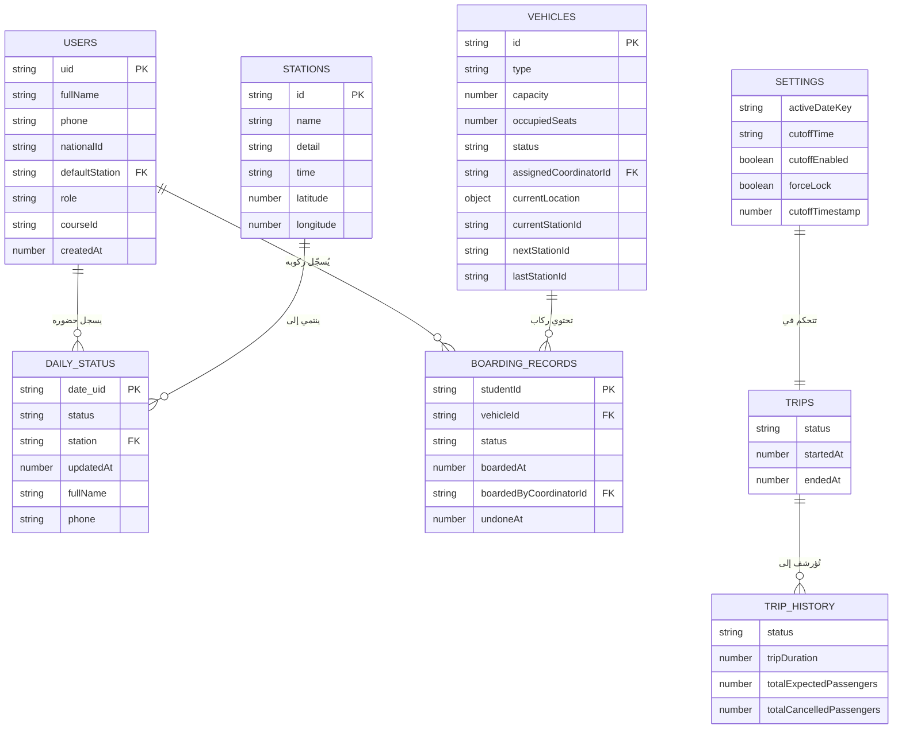

## ١٣.٢ المسارات الرئيسية

| المسار | الوصف | القراءة | الكتابة |
|--------|-------|---------|---------|
| `rakeb/users/{uid}` | بيانات المستخدم | المستخدم نفسه + Admin | المستخدم نفسه (role ثابت) + Admin |
| `rakeb/stations` | نقاط التجمع | الكل | Admin فقط |
| `rakeb/settings/default` | إعدادات النظام | كل المسجلين | Admin فقط |
| `rakeb/dailyStatus/default/{date}/{uid}` | حالة الحضور | كل المسجلين | المستخدم نفسه (قبل الموعد) + Admin |
| `rakeb/vehicles/default/{date}/{vehicleId}` | المركبات | كل المسجلين | Admin فقط |
| `rakeb/boardingRecords/{date}/{studentId}` | سجلات الركوب | الطالب (سجله فقط) + Admin | Admin فقط |
| `rakeb/trips/default/{date}` | الرحلة النشطة | كل المسجلين | Admin فقط |
| `rakeb/tripHistory/default/{date}` | أرشيف الرحلات | Admin فقط | Admin فقط |
| `rakeb/auditLog/default` | سجل التدقيق | Admin فقط | Admin فقط |

## ١٣.٣ تدفق البيانات

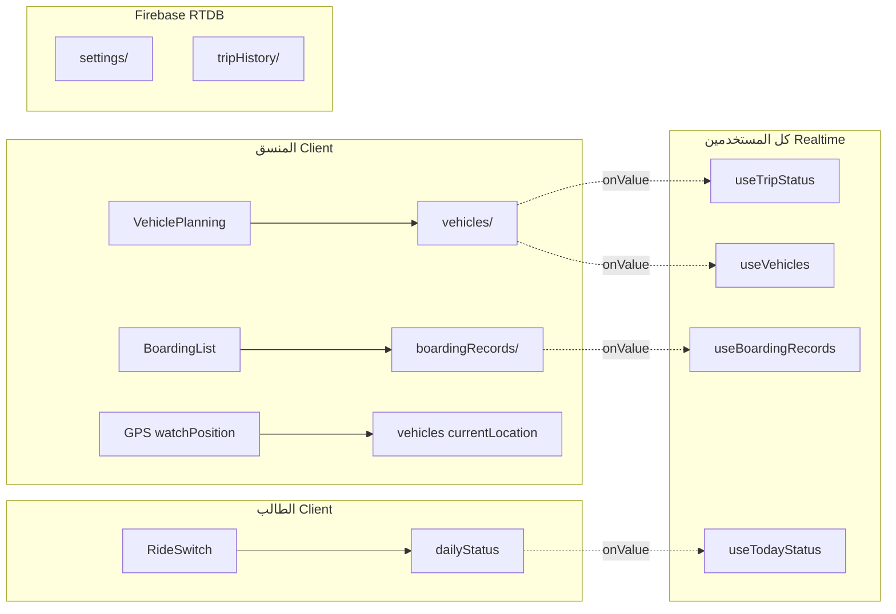

---

# 14. هيكل النظام

## ١٤.١ المكونات الرئيسية

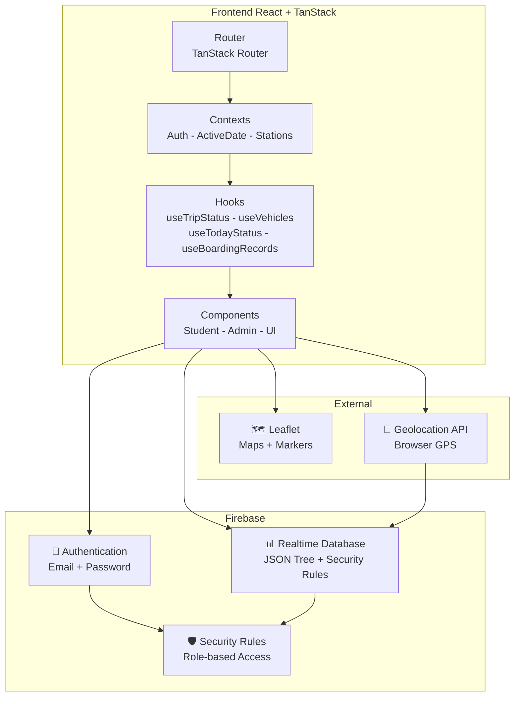

## ١٤.٢ التقنيات المستخدمة

| الطبقة | التقنية | الإصدار | الغرض |
|--------|---------|---------|-------|
| **Frontend Framework** | React | 19.x | بناء واجهة المستخدم |
| **Router** | TanStack Router | 1.x | التنقل بين الصفحات |
| **Build Tool** | Vite | 8.x | بناء وتطوير |
| **Language** | TypeScript | 5.x | Type Safety |
| **Styling** | Tailwind CSS | 4.x | التصميم |
| **UI Components** | Radix UI | — | مكونات أساسية (Dialog, Select, Tabs...) |
| **Animations** | Framer Motion | 12.x | حركات الانتقال |
| **Auth** | Firebase Auth | 12.x | المصادقة |
| **Database** | Firebase Realtime DB | 12.x | البيانات في الوقت الفعلي |
| **Maps** | Leaflet + React-Leaflet | 1.9 / 5.0 | الخرائط التفاعلية |
| **Charts** | Recharts | 2.x | الرسوم البيانية |
| **Forms** | React Hook Form + Zod | 7.x / 3.x | التحقق من المدخلات |
| **Toasts** | Sonner | 2.x | الإشعارات الفورية |
| **Export** | XLSX + jsPDF | 0.18 / 4.x | تصدير البيانات |
| **Mobile Drawer** | Vaul | 1.x | Bottom Sheets |

## ١٤.٣ التحديثات في الوقت الفعلي

كل البيانات المهمة بتتحدث في الوقت الفعلي عبر Firebase `onValue` listeners:

| البيانات | الـ Hook / Context | المستمعين |
|----------|-------------------|-----------|
| حالة المصادقة | `AuthContext` | الكل |
| نقاط التجمع | `StationsContext` | الكل |
| التاريخ النشط والإعدادات | `ActiveDateContext` | الكل |
| حالة الرحلة | `useTripStatus()` | الطلاب والمنسقين |
| المركبات | `useVehicles()` | الطلاب والمنسقين |
| حالة الحضور | `useTodayStatus()` | المنسقين |
| سجلات الركوب | `useBoardingRecords()` | المنسقين |
| سجل الركوب للطالب | `useStudentBoardingRecord()` | الطالب |
| GPS Offset | `ActiveDateContext` | الكل |

---

# 15. خطة التشغيل التجريبي

## ١٥.١ الهدف

تشغيل راكب **بالتوازي** مع سير العمل الحالي (Google Forms + WhatsApp) لمدة محددة لتقييم الأداء وجمع الملاحظات.

## ١٥.٢ المقارنة

| البُعد | سير العمل الحالي | راكب |
|--------|------------------|------|
| التسجيل | Google Forms | حساب ثابت + Toggle |
| التأكيد | رسائل WhatsApp | ضغطة واحدة |
| التخطيط | Excel يدوي | لوحة تحكم مع تخطيط مركبات |
| التتبع | لا يوجد | GPS حي على الخريطة |
| الحضور | ورقي / رسائل | تسجيل رقمي فوري |
| التاريخ | لا يوجد | أرشيف كامل |

## ١٥.٣ خطة التنفيذ

| المرحلة | المدة | الأنشطة |
|---------|-------|---------|
| **الإعداد** | أسبوع 1 | إعداد الحسابات + إدخال نقاط التجمع + تدريب المنسقين |
| **التجريب المحدود** | أسبوع 2-3 | تشغيل مع 10-15 طالب + النظام القديم يعمل بالتوازي |
| **التوسع** | أسبوع 4-5 | توسيع لـ 30-50 طالب + تقليل الاعتماد على النظام القديم |
| **الاعتماد الكامل** | أسبوع 6+ | إيقاف النظام القديم + الاعتماد الكامل على راكب |

## ١٥.٤ حجم العينة

| الفئة | العدد |
|-------|-------|
| طلاب تجريبيين | 10 → 50 (تدريجي) |
| منسقين | 2-3 |
| نقاط تجمع | 3-5 |
| مركبات يومية | 1-3 |
| أيام التشغيل | 15-20 يوم |

## ١٥.٥ المسؤوليات

| المسؤول | المهمة |
|---------|--------|
| فريق التطوير | الدعم الفني + إصلاح المشاكل + التحديثات |
| المنسق الرئيسي | تدريب باقي المنسقين + جمع الملاحظات |
| المنسقين | استخدام النظام + تقديم ملاحظات يومية |
| عينة الطلاب | استخدام النظام + تقييم التجربة |

---

# 16. مؤشرات الأداء الرئيسية

## ١٦.١ مؤشرات تشغيلية

| # | المؤشر | الوحدة | القبل (تقدير) | الهدف | طريقة القياس |
|---|--------|--------|---------------|-------|-------------|
| 1 | **وقت التخطيط** | دقيقة | 30-45 | < 5 | توقيت من فتح الداشبورد لبدء اليوم |
| 2 | **وقت تسجيل الحضور** | دقيقة/طالب | 2-3 | < 0.1 | ضغطة واحدة = تأكيد فوري |
| 3 | **الأخطاء في الأسماء/النقاط** | عدد/يوم | 3-5 | 0 | حسابات ثابتة = بيانات صحيحة |
| 4 | **رسائل WhatsApp** | رسالة/يوم | 50-100 | 0 | عداد الرسائل |
| 5 | **مكالمات تليفونية** | مكالمة/يوم | 10-20 | 0 | عداد المكالمات |
| 6 | **رضا الطلاب** | درجة (1-5) | — | ≥ 4.0 | استبيان بعد التجربة |
| 7 | **رضا المنسقين** | درجة (1-5) | — | ≥ 4.0 | استبيان بعد التجربة |
| 8 | **معدل التبني** | نسبة | 0% | ≥ 80% | عدد المستخدمين النشطين / الإجمالي |
| 9 | **استخدام التتبع** | نسبة | 0% | ≥ 60% | عدد الطلاب اللي فتحوا صفحة التتبع |
| 10 | **إتمام الرحلات** | نسبة | — | 100% | رحلات مكتملة / رحلات مخططة |

## ١٦.٢ مؤشرات فنية

| المؤشر | الهدف |
|--------|-------|
| وقت تحميل الصفحة (LCP) | < 2 ثانية |
| وقت الاستجابة (FID) | < 100 ملي ثانية |
| نسبة الأخطاء (Error Rate) | < 1% |
| وقت تحديث GPS | كل 10 ثواني |
| وقت الاتصال بالخادم | < 10 ثواني (Safety Timeout) |

---

# 17. معايير النجاح

## ١٧.١ متى نعتبر راكب ناجح؟

راكب يُعتبر **ناجحاً** لما يحقق المعايير دي:

| # | المعيار | المقياس | الحد الأدنى |
|---|---------|---------|-------------|
| 1 | **إلغاء WhatsApp** | صفر رسائل WhatsApp للتنسيق | 0 رسالة/يوم |
| 2 | **إلغاء المكالمات** | صفر مكالمات لتأكيد الحضور | 0 مكالمة/يوم |
| 3 | **سرعة التخطيط** | وقت التخطيط < 5 دقائق | ≤ 5 دقائق |
| 4 | **دقة البيانات** | صفر أخطاء في الأسماء/النقاط | 0 أخطاء |
| 5 | **تبني الطلاب** | ≥ 80% من الطلاب يستخدمون النظام | ≥ 80% |
| 6 | **رضا المنسقين** | المنسقين يفضلون راكب على النظام القديم | ≥ 4/5 |
| 7 | **رضا الطلاب** | الطلاب يفضلون راكب على النظام القديم | ≥ 4/5 |
| 8 | **استقرار النظام** | لا أعطال حرجة أثناء التشغيل | 0 أعطال حرجة |
| 9 | **إتمام الرحلات** | كل الرحلات بتتم بنجاح | 100% |
| 10 | **تتبع فعّال** | الطلاب يشوفوا الباص على الخريطة | ≥ 60% استخدام |

## ١٧.٢ متى نُوقف التجربة؟

| الحالة | الإجراء |
|--------|---------|
| أعطال متكررة تمنع التنقل | إيقاف + إصلاح + إعادة تشغيل |
| رفض واسع من الطلاب (< 30% تبني) | مراجعة UX + تعديلات + إعادة تقييم |
| مشاكل أمنية حرجة | إيقاف فوري + إصلاح |

---

# 18. خارطة الطريق المستقبلية

## ١٨.١ المراحل القادمة

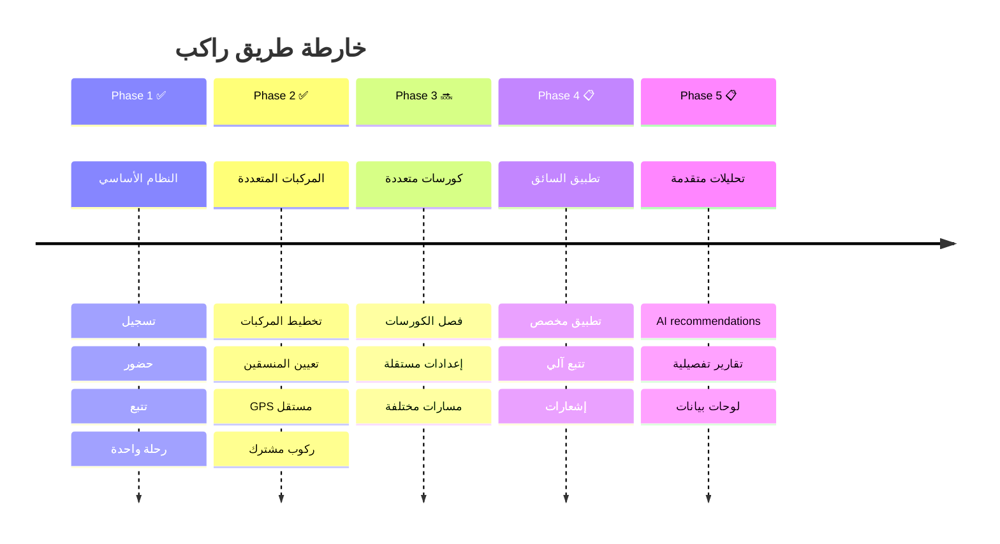

## ١٨.٢ تفاصيل كل مرحلة

### Phase 3 — كورسات متعددة (Multi-Course) 🔜

| الميزة | الوصف |
|--------|-------|
| فصل الكورسات | كل كورس ليه إعدادات ومسارات ومركبات مستقلة |
| Course ID | كل البيانات مقسمة حسب `courseId` |
| إعدادات مستقلة | مواعيد ونقاط تجمع مختلفة لكل كورس |
| Dashboard موحد | لوحة تحكم واحدة مع فلتر حسب الكورس |

### Phase 4 — تطبيق السائق (Driver App)

| الميزة | الوصف |
|--------|-------|
| دور جديد: `driver` | حساب مخصص للسائقين |
| GPS آلي | تتبع تلقائي بدون تدخل المنسق |
| إشعارات مباشرة | تنبيهات للسائق عن المحطات والطلاب |
| تقييم الرحلة | الطلاب يقيّموا الرحلة |

### Phase 5 — تحليلات وتقارير متقدمة

| الميزة | الوصف |
|--------|-------|
| QR Boarding | تسجيل الركوب بمسح QR Code |
| AI Recommendations | اقتراح عدد المركبات بناءً على البيانات التاريخية |
| Fleet Management | إدارة أسطول ثابت مع لوحات سيارات ومعلومات |
| تقارير PDF متقدمة | تقارير يومية/أسبوعية/شهرية |
| إشعارات FCM | Cloud Functions + Firebase Cloud Messaging |
| Dashboard Analytics | Recharts متقدم مع مقارنات وتريندات |
| تصدير متقدم | Excel مع charts + PDF مع تصميم احترافي |

---

# 19. المخاطر والتخفيف

## ١٩.١ المخاطر التشغيلية

| # | المخاطر | الاحتمال | التأثير | التخفيف |
|---|---------|----------|---------|---------|
| O1 | المنسق ينسى يفتح GPS | متوسط | عالي | رسالة تحذيرية عند بدء الرحلة بدون GPS |
| O2 | المنسق ينسى يسجّل ركوب طالب | متوسط | متوسط | قائمة Checklist واضحة + عدّاد |
| O3 | انقطاع الإنترنت أثناء الرحلة | متوسط | عالي | Firebase offline cache + retry |
| O4 | المنسق يقفل التطبيق بالغلط | منخفض | متوسط | Stale recovery (60 ثانية) |
| O5 | تداخل بين منسقين على نفس المركبة | منخفض | عالي | Atomic Transaction (Take Control) |

## ١٩.٢ المخاطر التقنية

| # | المخاطر | الاحتمال | التأثير | التخفيف |
|---|---------|----------|---------|---------|
| T1 | Firebase Realtime DB limits | منخفض | عالي | مراقبة الاستخدام + خطة ترقية |
| T2 | GPS دقة منخفضة | متوسط | متوسط | `enableHighAccuracy: true` |
| T3 | Race Conditions في الركوب | منخفض | عالي | Transactions + Security Rules |
| T4 | Security Rules bypass | منخفض | عالي (أمني) | Rules شاملة + اختبار |
| T5 | حالات orphaned في البيانات | منخفض | متوسط | `cleanStaleTrips()` reconciliation |

## ١٩.٣ مخاطر تبني المستخدمين

| # | المخاطر | الاحتمال | التأثير | التخفيف |
|---|---------|----------|---------|---------|
| U1 | الطلاب يرفضون استخدام النظام | متوسط | عالي | تصميم سهل + عربية مصرية + تدريب |
| U2 | المنسقين يفضلون WhatsApp | متوسط | عالي | إثبات سرعة النظام + تدريب عملي |
| U3 | مشاكل في الأجهزة القديمة | منخفض | متوسط | Mobile-first + PWA-ready |
| U4 | صعوبة التسجيل | منخفض | متوسط | تسجيل متعدد الخطوات + رسائل واضحة |

---

# 20. الدروس المستفادة

## ٢٠.١ قرارات التصميم والأسباب

### 🔥 ليه اخترنا Firebase؟

| السبب | التفاصيل |
|-------|----------|
| **Realtime بالطبيعة** | النقل محتاج تحديثات لحظية — Firebase Realtime DB مثالي |
| **بدون Backend** | مفيش حاجة لـ API server — الـ client بيتكلم مع Firebase مباشرة |
| **Security Rules** | صلاحيات دقيقة بدون كود server-side |
| **Authentication مدمج** | Email/Password جاهز بدون إعداد |
| **Free Tier كافي** | للحجم الحالي، Free/Spark Plan كافي |
| **Offline Support** | Firebase بيخزن البيانات محلياً وبيعمل sync لما الاتصال يرجع |

### 🗺️ ليه فضلنا مع Leaflet؟

| السبب | التفاصيل |
|-------|----------|
| **مفتوح المصدر** | مفيش تكلفة أو API keys مقيدة |
| **خفيف** | أسرع من Google Maps SDK |
| **مرونة** | تحكم كامل في الـ markers والـ tiles |
| **React-Leaflet** | مكتبة React متكاملة وناضجة |

### 🚫 ليه الطلاب مايختاروش المركبة؟

| السبب | التفاصيل |
|-------|----------|
| **تبسيط التجربة** | الطالب يأكد حضوره بس — أقل عبء ذهني |
| **مرونة تشغيلية** | المنسقين يقدروا يعيدوا توزيع الطلاب بحرية |
| **منع الازدحام** | لو الطلاب اختاروا، كل الناس هتختار أول مركبة |
| **الواقع العملي** | كل المركبات بتمر على نفس المسار — لا فرق حقيقي |

### 👤 ليه المنسقين بيملكوا المركبات؟

| السبب | التفاصيل |
|-------|----------|
| **المسؤولية الواضحة** | كل منسق مسؤول عن مركبة واحدة |
| **GPS مستقل** | كل منسق بيشارك موقعه لمركبته |
| **منع التضارب** | Atomic Transaction بيمنع منسقين يتحكموا في نفس المركبة |
| **Recovery** | لو المنسق فصل، منسق تاني يقدر يأخذ المركبة بعد 60 ثانية |

### 📍 ليه نقاط التجمع ثابتة؟

| السبب | التفاصيل |
|-------|----------|
| **تبسيط المسار** | المركبة بتمر على نقاط محددة بترتيب ثابت |
| **تنسيق أسهل** | الطلاب عارفين فين يوقفوا |
| **GPS أدق** | النقاط ليها إحداثيات ثابتة على الخريطة |
| **استثناء: Custom Location** | الطالب يقدر يحدد موقعه الجغرافي كحالة استثنائية |

### 📅 ليه إنهاء اليوم يدوي مش تلقائي؟

| السبب | التفاصيل |
|-------|----------|
| **الثقة** | لو مركبة "انتهت" بالغلط، النظام مش هينقل اليوم غصب |
| **المرونة** | المنسق ممكن يحتاج يفتح مركبة تانية بعد ما الأولى خلصت |
| **الأمان** | CAS Transaction بيمنع إنهاء اليوم مرتين |

### 🔄 ليه Boarding Records مش boolean؟

| السبب | التفاصيل |
|-------|----------|
| **Audit Trail** | نعرف مين سجّل مين، إمتى، وعلى أنهي مركبة |
| **Undo Support** | التراجع بيغير الحالة لـ `undone` بدل ما يحذف |
| **Vehicle Scope** | الركوب مرتبط بمركبة محددة |

---

# 21. المسرد

| المصطلح | بالإنجليزية | التعريف |
|---------|-------------|---------|
| **يوم النقل** | Transportation Day | يوم واحد فيه رحلة نقل — محدد بـ `activeDateKey` (YYYY-MM-DD) |
| **نقطة التجمع** | Pickup Point / Station | مكان محدد بيتجمع فيه الطلاب لركوب المركبة |
| **المنسق** | Coordinator / Admin | الشخص المسؤول عن إدارة النقل والتحكم في المركبات |
| **الحضور** | Attendance / Daily Status | حالة الطالب اليومية — "هحضر" (`riding`) أو "مش هحضر" (`cancelled`) |
| **الركوب** | Boarding | تسجيل ركوب الطالب فعلياً في مركبة معينة |
| **المركبة** | Vehicle | أتوبيس أو ميكروباص مخصص لنقل الطلاب |
| **الـ Timeline** | Station Timeline | مسار بصري بيوضح تقدم المركبة بين نقاط التجمع |
| **الرحلة** | Trip | مسار مركبة واحدة من البداية للوجهة النهائية |
| **الموعد النهائي** | Cutoff Time | الوقت اللي بيتقفل فيه التسجيل — الطلاب مايقدروش يغيّروا حالتهم بعده |
| **القفل اليدوي** | Force Lock | قفل فوري للتسجيل من المنسق — بغض النظر عن الوقت |
| **التعيين** | Assignment / Take Control | ربط منسق بمركبة محددة (Atomic Transaction) |
| **الـ Heartbeat** | Heartbeat | إشارة دورية (كل 10 ثواني) من المنسق للدلالة على نشاطه |
| **Stale** | Stale | حالة المنسق اللي مبعتش Heartbeat من أكتر من 60 ثانية |
| **CAS** | Compare-and-Swap | عملية atomique لتغيير قيمة بعد التأكد من القيمة الحالية |
| **إنهاء اليوم** | Close Day | إجراء بينهي كل رحلات اليوم وبينقل لليوم التالي |
| **كرياتيفا** | Creativa | الوجهة النهائية — مركز التدريب |
| **Active Date Key** | Active Date Key | تاريخ الرحلة النشطة — المفتاح الرئيسي للنظام |
| **Boarding Record** | Boarding Record | سجل ركوب طالب — يحتوي على الطالب والمركبة والمنسق والوقت |
| **Security Rules** | Security Rules | قواعد صلاحيات Firebase اللي بتحدد مين يقرأ ومين يكتب |
| **Audit Log** | Audit Log | سجل تدقيق لكل الإجراءات المهمة في النظام |

---

# 22. الخاتمة

## ٢٢.١ ملخص المشروع

**راكب** هو حل متكامل لمشكلة حقيقية — إدارة نقل طلاب الكورسات والمعسكرات التدريبية. المنصة بتحوّل عملية يدوية مُرهقة وعرضة للأخطاء لنظام رقمي ذكي بيعمل في الوقت الفعلي.

## ٢٢.٢ القيمة المُقدّمة

| لمين | القيمة |
|------|--------|
| **للطلاب** | تجربة سهلة — تأكيد بضغطة + تتبع حي + اطمئنان |
| **للمنسقين** | وفر وقت هائل — تخطيط سريع + تنسيق بدون WhatsApp |
| **للإدارة** | رؤية شاملة — بيانات دقيقة + تقارير + تاريخ |
| **للمؤسسة** | احترافية — نظام رقمي بدل أدوات مبعثرة |

## ٢٢.٣ ليه راكب أفضل من النظام الحالي؟

| البُعد | النظام الحالي | راكب |
|--------|--------------|------|
| **الوقت** | 45+ دقيقة تخطيط | < 5 دقائق |
| **الدقة** | أخطاء يدوية متكررة | صفر أخطاء |
| **التواصل** | 50-100 رسالة WhatsApp | صفر رسائل |
| **التتبع** | لا يوجد | GPS حي على الخريطة |
| **التوثيق** | لا يوجد | سجل كامل وقابل للتصدير |
| **التوسع** | صعب جداً | بضغطة زر |
| **الاحترافية** | أدوات مبعثرة | نظام موحد ومتكامل |

---

> **راكب** — لأن وقت المنسقين أثمن من إنه يتصرف على WhatsApp.

---

*هذا المستند هو المرجع الرسمي والوحيد لمشروع راكب. أي تعارض بين هذا المستند ومصادر أخرى، يُعتمد هذا المستند.*

</div>
